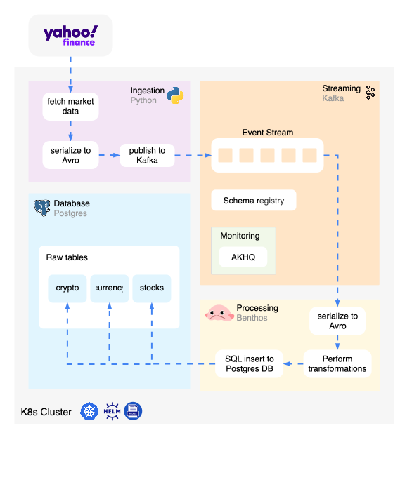

# Real-time Financial Data Pipeline on Kubernetes
This project deploys a real-time financial data pipeline to Kubernetes, using Helm and Helmfile for managing deployments. 
The aim of this project is to provide an end-to-end learning environment for people wanting to learn more about real-time 
data technologies such as Kafka, alongside containers.



## Components
Each component is deployed as a separate Helmfile release, based on their functionality and dependencies. This modular approach
is useful for debugging and experimenting, for example swapping out Postgres for another database. 
1. **Ingestion**: A Python script fetches real-time financial data from an external API and publishes it to Kafka topics.
2. **Streaming**: This component includes Kafka and Schema Registry, it forms the core of the data pipeline.
3. **Processing**: A Benthos worker processes Kafka messages, performs transformations, and routes events to the appropriate tables in Postgres.
4. **Storage**: A PostgreSQL database that stores the processed financial data.
5. **Monitoring**: Contains tools for monitoring and managing the pipeline, including AKHQ for Kafka management.

## Ingestion
The ingestion release deploys a ConfigMap and a Deployment. The ConfigMap contains the Python script that fetches
financial data from YahooFinance with [yfinance](https://ranaroussi.github.io/yfinance/) and publishes it to Kafka.
This was preferable to using a Docker image as it allows for easy modification of the script without needing to rebuild the image.

## Streaming
The Streaming release sets up Kafka, which forms the core of the data pipeline and has several dependencies. The 
Streaming release also includes schema registry, which is used to manage and validate schemas of messages in Avro format. 

### Kafka
Kafka is deployed with three topics:
* `tickers.currency`
* `tickers.crypto`
* `tickers.stocks`

### Schema Registry
Schemas for each topic are stored in the `schemas/` directory. A Job running a Python [script(../charts/streaming/scripts/add_schemas.py) 
loads schemas into the registry during startup. 
Get existing schemas:
```bash
curl -X GET http://streaming-schema-registry.default.svc.cluster.local:8081/subjects
````

Useful commands for managing schemas in the schema registry:
```bash
    curl -X POST -H "Content-Type: application/vnd.schemaregistry.v1+json" \
          --data '{"schema": "{\"type\":\"record\",\"name\":\"tickers.stocks\",\"namespace\":\"{{ .Values.streaming.topics.stocks }}\",\"fields\":[{\"name\":\"change\",\"type\":\"float\"},{\"name\":\"change_percent\",\"type\":\"float\"},{\"name\":\"exchange\",\"type\":\"string\"},{\"name\":\"id\",\"type\":\"string\"},{\"name\":\"tickers\",\"type\":\"string\"},{\"name\":\"price\",\"type\":\"float\"},{\"name\":\"price_hint\",\"type\":\"string\"},{\"name\":\"source_api\",\"type\":\"string\"},{\"name\":\"event_id\",\"type\":\"string\"},{\"name\":\"ingestion_ts\",\"type\":\"int\"},{\"name\":\"quote_type\",\"type\":\"int\"},{\"name\":\"ticker_ts\",\"type\":\"int\"}]}"}' \
          "http://streaming-schema-registry.default.svc.cluster.local:8081/subjects/tickers.stocks-value/versions"

```

    curl -X POST -H "Content-Type: application/vnd.schemaregistry.v1+json" \
      --data '{"schema": "{\"type\":\"record\",\"name\":\"tickers.stocks\",\"namespace\":\"tickers.stocks\",\"fields\":[{\"name\":\"change\",\"type\":[\"float\",\"null\"],\"default\":null},{\"name\":\"change_percent\",\"type\":[\"float\",\"null\"],\"default\":null},{\"name\":\"exchange\",\"type\":[\"string\",\"null\"],\"default\":null},{\"name\":\"ingestion_ts\",\"type\":[\"string\",\"null\"],\"default\":null},{\"name\":\"id\",\"type\":[\"string\",\"null\"],\"default\":null},{\"name\":\"market_hours\",\"type\":[\"int\",\"null\"],\"default\":null},{\"name\":\"price\",\"type\":[\"float\",\"null\"],\"default\":null},{\"name\":\"price_hint\",\"type\":[\"string\",\"null\"],\"default\":null},{\"name\":\"source_api\",\"type\":[\"string\",\"null\"],\"default\":null},{\"name\":\"event_id\",\"type\":[\"string\",\"null\"],\"default\":null},{\"name\":\"quote_type\",\"type\":[\"int\",\"null\"],\"default\":null},{\"name\":\"time\",\"type\":[\"string\",\"null\"],\"default\":null}]}"}' \
      "streaming-schema-registry.default.svc.cluster.local:8081/subjects/tickers.stocks-value/versions"

Delete a schema version:
```bash
curl -X DELETE http://streaming-schema-registry.default.svc.cluster.local:8081/subjects/tickers.stocks-value/versions/2?permanent=true
```
GET /schemas/ids/1 HTTP/1.1
curl -X GET http://streaming-schema-registry.default.svc.cluster.local:8081/subjects


kcp ./charts/streaming/scripts debug-python:/scripts

### Useful Commands:
Create topic:
```zsh
kubectl exec -it fdp-kafka-controller-0 -- bash -c "kafka-topics.sh --bootstrap-server localhost:9092 --topic fdp-topic --create"
```
List topics:
```zsh
kubectl exec -it fdp-kafka-controller-0 -- bash -c "kafka-topics.sh --bootstrap-server localhost:9092 --list"
```


## Storage
PostgreSQL is used for storing raw financial data in three tables for each financial asset. 

### Postgres
To connect to postgres, start a session in the pod:
```bash
kubectl exec -it storage-postgresql-0 bash
```

Log in:
```bash
psql -U benthos -d tickers -p 5432
# Password is benthos
```


List databases:
\dt

Query the data:
```sql
SELECT COUNT(*) FROM finance_data_ingress;
```


## Monitoring


### AKHQ
helm repo add akhq https://akhq.io/

Port forwarding:
```zsh
kubectl port-forward pod/<pod-name> 8080:8080 -d
ingestion-ingestion-7cb8dd856c-tppd7
```

## Future work
A number of improvements could be made to productionize this system:
- Ingestion concurrency: Currently ingestion runs in a single-thread, meaning parallelism is not fully utilised. 
Adding asyncio or threading could improve performance, however, there are rate limits on the API.
- Testing: Add unit tests and integration tests to ensure reliability and correctness of ingestion.
- Monitoring: Adding Grafana and Prometheus to monitor the health of the cluster would be essential for a productionized system.
- Secrets management: 